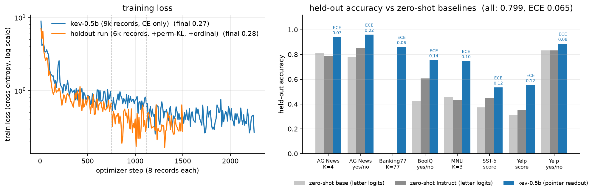
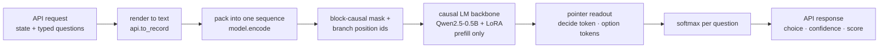
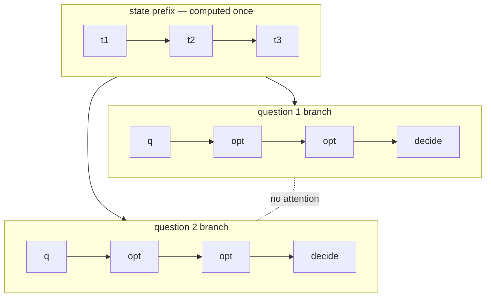

# kev


A small repository for training and serving a **Jev-inspired decision model**: a language model that reads one document once, answers many typed questions about it in a single forward pass, and returns calibrated **probabilities** instead of generated text. It is a from-scratch reconstruction of the architecture Archer Hume inferred for TypeSafe's Jev in [Jev's Architecture Unmasked](https://archerhume.com/posts/jevs-architecture-unmasked), and it speaks TypeSafe's public [`/v1/systemone`](https://docs.typesafe.ai/api) API so the official `typesafe-sdk` works against it with a `base_url` change. The code is plain and short: `model.py` is ~100 lines (packing, block-causal mask, pointer head), `train.py` is ~100 lines of LoRA fine-tuning, `api.py` is ~110 lines mapping TypeSafe's three question types onto one readout. That's it. The checkpoint described here, `kev-0.5b`, trains on a MacBook Pro (M5, 32 GB) in about 1h45m.



It is not Jev. The backbone is Qwen2.5-0.5B and it knows very little. The point is to test the *mechanism* — shared state, isolated questions, direct probability readout, proper-scoring-rule training — and the mechanism checks out: question isolation is exact (a secret in a sibling question is invisible, p=0.03 vs 0.03 absent; in the state it's read at p=0.99), N questions packed into one request give the same probabilities as N separate requests to 4e-6, and the fine-tuned readout beats zero-shot letter-logit baselines by 10–30 points on every source while being better calibrated. Full recipe and numbers are in the [model card](MODEL_CARD.md).

## install

```
uv sync --extra serve
cd playground && npm install
```

Dependencies:

- [pytorch](https://pytorch.org) (MPS on Apple Silicon, CUDA untested but should work) <3
- `transformers` + `peft` for the Qwen backbone and LoRA <3
- `datasets` to pull the six public training sets <3
- `fastapi` + `uvicorn` for the server, `typesafe-sdk` for the conformance tests <3
- `matplotlib` (dev) for the plot above <3
- Node 20+ for the playground

## quick start

If you just want to see it work, train a tiny sanity model (~1 minute, 160 records) and point the server and playground at it:

```sh
uv run python -m kev.train --n_per_source 40 --accum 4 --out runs/smoke
uv run --extra serve python -m kev.serve --run runs/smoke --port 8009
```

then in another terminal:

```sh
cd playground && npm run dev -- -p 3001
```

and open http://localhost:3001. The answers will be garbage (it has seen 160 records) but every mechanism test already passes: click **Packed vs separate** and you'll see the max probability difference between one 6-question request and six 1-question requests is 0.0000, and the **Isolation probe** preset shows the sibling-question secret is invisible. That's the mask doing its job before any real learning.

Or hit the API directly:

```sh
curl -s localhost:8009/v1/systemone -H 'content-type: application/json' -d '{
  "state": "Shoes arrived two weeks late and in the wrong size. Also I see two charges on my card.",
  "model": "kev-latest",
  "questions": {
    "department":  {"type": "choice", "instructions": "Which team should handle this?",
                    "criteria": {"returns": "Exchanges, refunds, wrong or damaged items",
                                 "shipping": "Delivery status, delays, lost packages",
                                 "billing": "Charges, invoices, payment problems"}},
    "escalate":    {"type": "noul",  "instructions": "Does this need urgent human attention?"},
    "frustration": {"type": "score", "instructions": "How frustrated is the customer?",
                    "criteria": ["Calm", "Frustrated", "Very angry"]}
  }}'
```

```json
{"model": "kev-latest",
 "answers": {
   "department":  {"type": "choice", "choice": "returns", "confidence": 0.92,
                   "probabilities": {"returns": 0.94, "shipping": 0.04, "billing": 0.02}},
   "escalate":    {"type": "noul", "noul": 0.47},
   "frustration": {"type": "score", "score": 0.67, "confidence": 0.74,
                   "legend": {"0": "Calm", "1": "Frustrated", "2": "Very angry"},
                   "probabilities": {"0": 0.43, "1": 0.47, "2": 0.10}}},
 "usage": {"input_tokens": 253, "output_tokens": 156}, "latency_ms": 162}
```

(That output is from the real `kev-0.5b`, not the smoke model.) With the official SDK it's the quickstart from their docs with two extra kwargs:

```python
from typesafe_sdk import TypeSafeClient, Choice, Noul, Score
client = TypeSafeClient(api_key="local", base_url="http://127.0.0.1:8009", model="kev-latest")
```

## reproducing kev-0.5b

If you'd rather skip the 1h45m, the trained adapter + head (38 MB) is on the [releases page](https://github.com/jaredpalmer/kev/releases/tag/v0.1.0):

```sh
mkdir -p runs && gh release download v0.1.0 -R jaredpalmer/kev -p 'kev-0.5b.tar.gz' -O - | tar xz -C runs && mv runs/kev-0.5b runs/kev
uv run --extra serve python -m kev.serve --run runs/kev --port 8009
```

The base model is not in the tarball; it downloads from the Hub on first load. To train it yourself instead: six public datasets are converted into TypeSafe-shaped requests (Banking77 as a 77-way Choice, AG News as a 4-way Choice plus derived yes/no Nouls, MNLI as a 3-way Choice, BoolQ as a Noul, SST-5 and Yelp as 5-level Scores), 1,500 records per source, two epochs:

```sh
uv run python -m kev.train --n_per_source 1500 --epochs 2 --perm_kl 0 --ord_w 0 --out runs/kev
```

That's the blue curve above: 9,000 records, 13,500 questions, 2,250 optimizer steps, ~0.29 s/record on an M5, final train loss 0.27. Then evaluate against zero-shot baselines from the same base model:

```sh
uv run python -m kev.evaluate --run runs/kev --n_per_source 150 \
    --baseline --baseline_instruct Qwen/Qwen2.5-0.5B-Instruct
```

which writes `runs/kev/eval.json` (the one committed here) and prints:

| | zero-shot base | zero-shot Instruct | **kev-0.5b** |
|---|---|---|---|
| Choice, 4-way (AG News) | 0.813 / 0.069 | 0.787 / 0.160 | **0.940 / 0.028** |
| Choice, 3-way (MNLI) | 0.460 / 0.225 | 0.433 / 0.390 | **0.747 / 0.100** |
| Choice, 77-way (Banking77) | – | – | **0.860 / 0.057** |
| Noul (BoolQ) | 0.427 / 0.274 | 0.607 / 0.084 | **0.753 / 0.136** |
| Score, 5 levels (Yelp) | 0.313 / 0.043 | 0.353 / 0.078 | **0.553 / 0.118** · MAE 0.54 levels |
| **all** (1,350 held-out questions) | | | **0.799 / 0.065** |

cells are accuracy / ECE (10-bin expected calibration error, lower is better). Fitting a single temperature on half the eval set (T=1.47) takes held-out ECE from 0.057 to **0.031** — the model is mildly overconfident and one scalar fixes most of it. Note these are in-distribution numbers: the test splits come from the same six datasets. Baselines use the same rendered text and read next-token logits over option letters A–H, so they're not run for K=77.

The `--perm_kl 0 --ord_w 0` flags matter: `kev-0.5b` was trained with plain cross-entropy and data-level option shuffling. Two loss terms were added afterwards and are now on by default — a symmetric KL between predictions under two option orders (`--perm_kl`, fights order sensitivity) and an ordinal `|E[level] − y|` term for Score (`--ord_w`). The orange curve is a run with both on and MNLI + SST-5 held out entirely (`--holdout mnli,sst5`) to measure out-of-source generalization; its eval isn't in yet.

## how it works

Four small ideas, one forward pass.



**Packing.** Everything goes into one token sequence. Reserved tokens (reused, rarely-seen Qwen specials — no new embeddings) mark the structure:

```
<state> …state…
<q> instructions <opt> option 1 </opt> <opt> option 2 </opt> … <decide>    ← question 1
<q> instructions <opt> option 1 </opt> <opt> option 2 </opt> … <decide>    ← question 2
```

User text is sanitized so it can never produce these tokens (`<|box_end|>` in an option becomes `<¦box_end¦>`); the fast Qwen tokenizer would otherwise happily forge them, and the "boundary forgery" playground preset shows the attack failing.

**Mask.** Position `i` may attend to `j` iff `j ≤ i and (seg[j] == 0 or seg[j] == seg[i])` — state is causal, each question sees the state plus its own earlier tokens, and never a sibling question. That one line is what makes isolation exact and lets the state be encoded once.



**Positions.** Every branch restarts its position ids right after the state, so each question looks to the model like "state followed by one question". Question order in the request is irrelevant, and it's exactly the layout a prefix-KV-cache server would use.

**Readout.** No token is ever sampled. A pointer head scores each option's `</opt>` hidden state against the `<decide>` hidden state (`z_k = (W_k h_opt[k]) · (W_q h_decide) / √d`), softmax over the K options. K can be 2 or 255; there is no fixed class list. Because `<decide>` comes *after* all options, the model reads the whole list before scoring — that's what makes "none of the above" possible, and why appending an irrelevant option can shift the odds between existing ones (mean |Δ log-odds| 0.13 here; the post measured ~0.28 for Jev). The three API types are one head: Noul is `[no, yes]`, Choice is `name: description` per key, Score is one option per level with `score = Σ k·p_k`. `confidence = (p_max − 1/K)/(1 − 1/K)` for Choice, matching TypeSafe's published adapter; Score confidence is a stand-in since theirs isn't published.

**Training.** LoRA r=16 on all projections (9.3M trainable, 1.9%), head from scratch, cross-entropy. Cross-entropy is a proper scoring rule: expected loss is minimized by reporting your true belief, which is the whole argument for reading probabilities out instead of generating "I'm 90% sure" as text. Train and serve go through the *same* renderer (`api.to_record`), so the model never sees a format at inference it didn't see in training — the first run got this wrong and it mattered.

## the playground

`playground/` is a small Next.js app that proxies `/kev/*` to the FastAPI server. Load a preset, edit the state/questions JSON, `⌘↵` to run. **Packed vs separate** shows both latencies and the max probability difference; **Permute *question*** re-asks a Choice under six option orders and shows the per-option spread. The **Isolation probe** and **Boundary forgery** presets are the two experiments from the blog post, live.

Extra endpoints behind the buttons: `POST /v1/systemone/permute` and `POST /v1/systemone/separate`. There's no auth; it's for localhost.

## efficiency notes

Everything is fp32 on Apple MPS with batch size 1 and a dense L×L mask materialized per sample, which is fine at 1k tokens and hopeless at Jev's 64k. Real serving wants a block-sparse / flex-attention kernel or the Hydragen-style trick of computing the state KV once and running branches as a batch against it. There's also no cross-request KV cache yet, so the same document queried twice is encoded twice. On the plus side, a request with 6 questions takes ~160 ms end to end and 2× less than six separate calls, with zero decoding steps.

Don't run two training jobs at once on MPS; each gets ~10× slower and the API starts looking broken.

## todos

- Evaluate the holdout run (orange curve) and report out-of-source MNLI / SST-5 numbers
- Ablation: same head without shared state / without branch mask, to separate "architecture" from "fine-tuned classifier"
- Soft-label sources (ChaosNLI, Jigsaw) so the model has legitimately-uncertain targets to learn from
- Batched training with a packed block mask so a 7B / 30B-A3B backbone is feasible on a real GPU
- Prefix KV cache across requests; bf16

## troubleshooting

`MPS backend out of memory` during training — don't pass `output_hidden_states=True` (we read `last_hidden_state` from the bare backbone) and don't add new tokens via peft's `trainable_token_indices`; both leak on MPS. If you're on a small Mac, drop `--n_per_source`.

Playground renders but the buttons do nothing and the header says `connecting…` forever — Next 16's dev server only trusts the hostname it was started with. Use `http://localhost:3001` or add your host to `allowedDevOrigins` in `next.config.ts` (`127.0.0.1` is already there). No error is logged; verify hydration with a real browser, not curl.

`Dataset scripts are no longer supported` — use `legacy-datasets/banking77`, already wired in `data.py`.

Tests: `uv run python -m pytest tests/test_unit.py -q` needs nothing but the tokenizer; `tests/test_api.py` needs a running server and `KEV_BASE_URL`. See [CONTRIBUTING.md](CONTRIBUTING.md).

## acknowledgements

The architecture claims tested here are [Archer Hume](https://archerhume.com/posts/jevs-architecture-unmasked)'s; the mistakes are ours. The API contract is TypeSafe's [System One](https://docs.typesafe.ai/api). The backbone is [Qwen2.5-0.5B](https://huggingface.co/Qwen/Qwen2.5-0.5B). Prefix-shared attention follows [Hydragen](https://arxiv.org/abs/2402.05099) and [DeFT](https://arxiv.org/abs/2404.00242); the single-pass listwise readout follows [FIRST](https://arxiv.org/abs/2406.15657). Trained on one laptop, no cloud GPUs were harmed.

Code, adapter and head are [Apache-2.0](LICENSE). Model card: [MODEL_CARD.md](MODEL_CARD.md).
