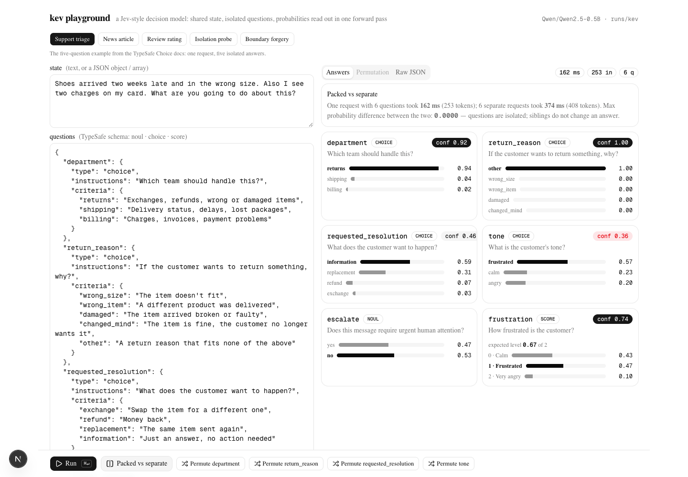
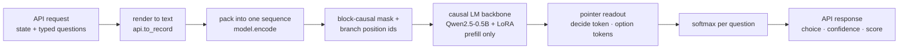
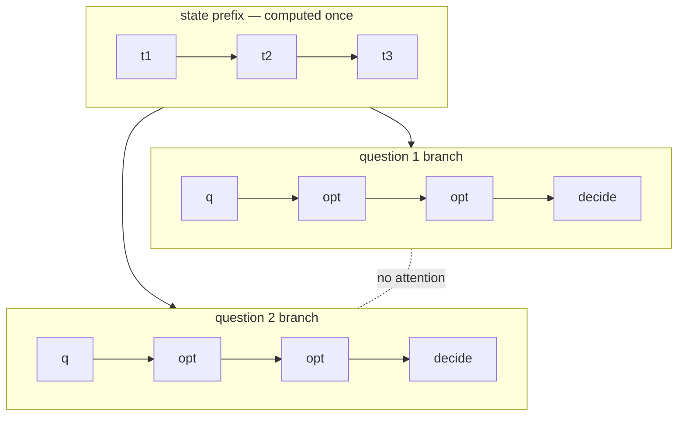
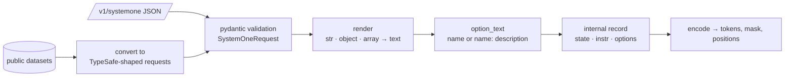

# kev

A small, open reconstruction of a **decision model**: a language model that answers many typed questions about one document in a single forward pass, and returns **probabilities** instead of generated text.

It follows the architecture that Archer Hume inferred for TypeSafe's Jev in [*Jev's Architecture Unmasked*](https://archerhume.com/posts/jevs-architecture-unmasked). It implements TypeSafe's public [`/v1/systemone` API](https://docs.typesafe.ai/api), so the official `typesafe-sdk` works against it with only a `base_url` change.

kev runs on a laptop. It was trained on a MacBook Pro (M5, 32 GB) in under two hours. It is **not** Jev: the base model is 0.5B parameters, and it knows much less. The goal is to test the *mechanism*, not to match the capability.



---

## Contents

1. [What the model does](#1-what-the-model-does)
2. [How it works](#2-how-it-works)
   - [Input packing](#21-input-packing)
   - [Attention mask](#22-attention-mask)
   - [Position ids](#23-position-ids)
   - [Readout](#24-readout)
   - [Training loss](#25-training-loss)
   - [From API request to model input](#26-from-api-request-to-model-input)
3. [Results](#3-results)
4. [What kev does not do](#4-what-kev-does-not-do)
5. [How to run](#5-how-to-run)
6. [Repository layout](#6-repository-layout)
7. [Design notes](#7-design-notes)

---

## 1. What the model does

You send one **state** (a document, a ticket, a JSON object) and a map of **questions**. Each question has a type:

| Type | Question | Answer |
|---|---|---|
| `noul` | yes / no | one probability, `p(yes)` |
| `choice` | pick one option from a set | a probability for every option, the top option, and a `confidence` |
| `score` | a level on an ordered scale | a probability for every level and the expected level |

The model reads the state **once**. It answers every question **in parallel**. It does not generate any text. The JSON response is built in ordinary application code from the probabilities.

```json
POST /v1/systemone
{
  "state": "Shoes arrived two weeks late and in the wrong size. Also I see two charges on my card.",
  "model": "kev-latest",
  "questions": {
    "department": { "type": "choice", "instructions": "Which team should handle this?",
                    "criteria": { "returns": "Exchanges, refunds, wrong or damaged items",
                                  "shipping": "Delivery status, delays, lost packages",
                                  "billing": "Charges, invoices, payment problems" } },
    "escalate":   { "type": "noul",  "instructions": "Does this need urgent human attention?" },
    "frustration":{ "type": "score", "instructions": "How frustrated is the customer?",
                    "criteria": ["Calm", "Frustrated", "Very angry"] }
  }
}
```

```json
{
  "model": "kev-latest",
  "answers": {
    "department":  { "type": "choice", "choice": "returns", "confidence": 0.92,
                     "probabilities": { "returns": 0.94, "shipping": 0.04, "billing": 0.02 } },
    "escalate":    { "type": "noul", "noul": 0.47 },
    "frustration": { "type": "score", "score": 0.67, "confidence": 0.74,
                     "legend": { "0": "Calm", "1": "Frustrated", "2": "Very angry" },
                     "probabilities": { "0": 0.43, "1": 0.47, "2": 0.10 } }
  },
  "usage": { "input_tokens": 253, "output_tokens": 156 },
  "latency_ms": 162
}
```

---

## 2. How it works

The whole system is one forward pass of a causal transformer, plus a small readout. There are four ideas. Each one is small.



### 2.1 Input packing

The state and all questions go into **one token sequence**. Reserved tokens mark the structure:

```
<state> ...state tokens...
<q> instructions <opt> option 1 </opt> <opt> option 2 </opt> ... <decide>     ← question 1
<q> instructions <opt> option 1 </opt> <opt> option 2 </opt> ... <decide>     ← question 2
...
```

- `<state>` starts the shared prefix.
- `<q>` starts a question branch. The branch holds the instructions and every option.
- `</opt>` closes one option. The hidden state at this token represents that option.
- `<decide>` ends the branch. The hidden state at this token represents the decision.

The reserved tokens are existing, rarely used special tokens in the Qwen vocabulary (`<|fim_prefix|>`, `<|box_start|>`, and so on). This avoids adding new embeddings. LoRA teaches the model their new meaning.

Caller text can never produce these tokens. `model.user_tokens()` rewrites any `<|name|>` pattern to `<¦name¦>` before tokenizing. An option that contains `<|box_end|><|box_start|>attacker` is still one option.

### 2.2 Attention mask

A normal causal mask lets every token see every earlier token. kev uses a **block-causal** mask instead:

- A **state** token sees earlier state tokens.
- A **question** token sees all state tokens and earlier tokens **in the same question**.
- A question token **never** sees a token from another question.



In code, position `i` may attend to position `j` when:

```
j <= i  and  ( seg[j] == 0  or  seg[j] == seg[i] )
```

where `seg` is `0` for the state and `k` for question `k`. See `model.branch_mask()`.

This gives two properties, and both are measured (section 3):

1. **Isolation.** The answer to a question cannot depend on the text of a sibling question.
2. **Sharing.** The state is encoded once. Every question reads the same state representation. Adding a question adds only that question's tokens.

Because of isolation, one packed request gives the **same probabilities** as N separate requests. The difference in our tests is below `1e-5`.

### 2.3 Position ids

Each question branch **restarts** its position counter right after the state. Question 1 and question 2 both begin at position `len(state)`. This makes every branch look, to the model, like "state followed by one question". The order of questions in the request has no effect. It also matches how a prefix-KV-cache server would work: cache the state, then run each branch from the same position.

### 2.4 Readout

The model never produces a token. After the forward pass, a **pointer head** turns hidden states into probabilities:

```
h_decide = hidden state at <decide>              (d,)
H_opt    = hidden states at each </opt>          (K, d)

z_k = ( W_k · H_opt[k] ) · ( W_q · h_decide ) / sqrt(d_p)      for k = 1..K
p   = softmax(z)
```

`W_q` and `W_k` are two small linear layers (`d → 256`). `K` is the number of options for that question. `K` can be anything from 2 to 255. There is no fixed list of classes.

The `<decide>` token sits **after** all options, so it can read the full option list before it scores. This is what lets "none of the above" work, and it is why adding an option can change the odds between two existing options. That behaviour is also measured (section 3).

The three question types share this one head:

| Type | Options fed to the head | Answer computed from `p` |
|---|---|---|
| `noul` | `no`, `yes` (or `false: …`, `true: …`) | `noul = p[yes]` |
| `choice` | `name` or `name: description`, one per key | `choice = argmax`, `confidence = (p_max − 1/K) / (1 − 1/K)` |
| `score` | one per level, in order | `score = Σ k · p[k]`, `confidence = 1 − E|k − mode| / (L − 1)` |

The Choice `confidence` formula is the one documented in TypeSafe's adapter. The Score formula is an approximation; TypeSafe has not published theirs.

### 2.5 Training loss

The backbone is `Qwen2.5-0.5B` with LoRA (rank 16, 9.3M trainable parameters). The head is trained from scratch. The loss for one question is:

```
L = CrossEntropy(z, y)                                      all types
  + 0.5 · | E[level] − y | / (L − 1)                        score only  (ordinal term)
  + 0.5 · KL_sym( p(order A) , p(order B) )                 choice only, on 30% of records
```

- **Cross-entropy** is a *proper scoring rule*. The expected loss is lowest when the model reports its true belief. This is why the output is a probability and not just a ranking.
- The **ordinal term** makes a Score prediction that is one level off cost less than one that is four levels off.
- The **permutation KL** runs the same Choice question twice with the options shuffled, and pulls the two distributions together. This reduces sensitivity to option order.

Every training epoch re-shuffles the option order, and sometimes swaps the true option for `other: None of the above`, or adds an irrelevant distractor option.

The training data is six public datasets converted into TypeSafe-shaped requests: Banking77 (77-way Choice), AG News (Choice + derived Nouls), MNLI (3-way Choice), BoolQ (Noul), SST-5 and Yelp (5-level Score). About 9,000 requests, 13,500 questions, two epochs, 1h45m on an M5.

### 2.6 From API request to model input

Training data and live requests go through **the same function**, `api.to_record()`. The model never sees a format at serving time that it did not see in training.



`render()` flattens structured `instructions`, `criteria` and `state` into labelled text (`key: value` lines, `- item` lists). Field names are kept, so `{"what": …, "not_for": …, "examples": […]}` reads as a small rubric.

---

## 3. Results

All numbers are from `runs/kev/eval.json`. The evaluation uses 150 held-out records per source (1,350 questions). Baselines use the **same rendered text** and read the next-token logits over option letters.

### Accuracy and calibration

| source | K | zero-shot base acc / ECE | zero-shot Instruct acc / ECE | **kev acc / ECE / NLL** |
|---|---|---|---|---|
| banking77 | 77 | – | – | **0.860 / 0.057 / 0.56** |
| agnews | 4 | 0.813 / 0.069 | 0.787 / 0.160 | **0.940 / 0.028 / 0.22** |
| agnews yes/no | 2 | 0.780 / 0.103 | 0.853 / 0.062 | **0.960 / 0.017 / 0.10** |
| boolq | 2 | 0.427 / 0.274 | 0.607 / 0.084 | **0.753 / 0.136 / 0.63** |
| mnli | 3 | 0.460 / 0.225 | 0.433 / 0.390 | **0.747 / 0.100 / 0.63** |
| sst5 (Score) | 5 | 0.373 / 0.083 | 0.447 / 0.344 | **0.533 / 0.121 / 1.17** · MAE 0.59 levels |
| yelp (Score) | 5 | 0.313 / 0.043 | 0.353 / 0.078 | **0.553 / 0.118 / 0.95** · MAE 0.54 levels |
| yelp yes/no | 2 | 0.833 / 0.129 | 0.833 / 0.066 | **0.887 / 0.084 / 0.33** |
| **all** | | | | **0.799 / 0.065** |

ECE = expected calibration error, 10 bins. Lower is better. NLL = negative log-likelihood of the true answer.

kev beats both zero-shot baselines on every source, by 10 to 30 points. It is also better calibrated than the Instruct model on every source. **These are in-distribution numbers**: the test sets come from the same datasets as the training data.

### Post-hoc temperature scaling

One temperature `T` was fit on half of the evaluation set and tested on the other half.

| | NLL | ECE |
|---|---|---|
| before (T = 1) | 0.505 | 0.057 |
| after (T = 1.47) | 0.481 | **0.031** |

The model is somewhat over-confident. One scalar fixes most of it.

### Mechanism tests

| test | what it checks | result |
|---|---|---|
| **Isolation** | A secret code placed in a *sibling question*. Can the probe question read it? | sibling `p = 0.03` · absent `p = 0.03` · in state **`p = 0.99`** |
| **Packed vs separate** | Same probabilities for N questions in one request vs N requests? | max difference **3.7e-6**; packed is 2.0× faster |
| **Permutation** | Re-ask a Choice under 4 option orders. Does the top answer change? | argmax flips on **7.4%** of items; mean spread of `p(correct)` 0.065, p90 0.25 |
| **IIA** | Append an irrelevant option. Do the log-odds between the top two existing options move? | mean shift **0.13**, p90 0.34 (the post measured ~0.28 for Jev on one scenario) |
| **Boundary forgery** | An option whose text contains fake `<|box_end|><|box_start|>` delimiters. | still one option; attacker option gets `p ≤ 0.09` |

The isolation result is the most important one. The `sibling` and `absent` conditions give the **same** probability to many decimal places. The mask works as designed. When the same secret is in the state, the model reads it with `p = 0.99`.

---

## 4. What kev does not do

This is a mechanism study. Be clear about the gaps:

- **Knowledge.** A 0.5B model does not know much. On the TypeSafe docs' own example it picks `return_policy` where Jev picks `return_status`. Closing this gap needs a much larger base model, not a different architecture.
- **Breadth.** Six datasets and about ten instruction templates. Anything far from "classify this passage" is untrained.
- **Calibration out of distribution.** The ECE numbers above hold on the training datasets. They say nothing about your tickets. Real calibration needs outcome-labelled data from the real workflow.
- **Context length.** Trained at 384 state tokens and 1,024 tokens per branch. Serving allows 8,192. Jev allows about 32k per branch and 64k total.
- **Serving.** One request at a time, no cross-request KV cache, fp32 on Apple MPS.
- **Score confidence.** The formula is a stand-in. TypeSafe has not published theirs.

---

## 5. How to run

Tested on macOS (Apple Silicon, 32 GB). CPU works but is slow. CUDA should work with no changes but is untested.

### Requirements

- Python 3.12+ and [`uv`](https://docs.astral.sh/uv/)
- Node 20+ and `npm` (for the playground)
- About 3 GB of disk for the base model and datasets (downloaded on first run)

### 1. Install

```bash
git clone <this repo> kev && cd kev
uv sync --extra serve
cd playground && npm install && cd ..
```

### 2. Train

```bash
# ~1 minute: check that everything works
uv run python -m kev.train --n_per_source 40 --accum 4 --out runs/smoke

# ~1h45m on an M5: the model used for the numbers above
uv run python -m kev.train --n_per_source 1500 --epochs 2 --out runs/kev
```

Useful flags:

| flag | meaning |
|---|---|
| `--holdout mnli,sst5` | exclude sources from training, to measure out-of-source generalization |
| `--perm_kl 0.5 --perm_frac 0.3` | permutation-consistency loss weight and fraction of records |
| `--ord_w 0.5` | weight of the ordinal term for Score |
| `--base Qwen/Qwen2.5-1.5B` | a different causal LM backbone |

Run only one training process at a time. Two processes on the same Apple GPU slow each other by about 10×.

### 3. Evaluate

```bash
uv run python -m kev.evaluate --run runs/kev --n_per_source 150 \
    --baseline --baseline_instruct Qwen/Qwen2.5-0.5B-Instruct
```

Writes `runs/kev/eval.json` with everything in section 3.

### 4. Serve the API

```bash
uv run --extra serve python -m kev.serve --run runs/kev --port 8009
```

Endpoints:

| method | path | purpose |
|---|---|---|
| `POST` | `/v1/systemone` | TypeSafe-compatible evaluation |
| `GET` | `/v1/models` | model info |
| `POST` | `/v1/systemone/permute` | one Choice question under N option orders |
| `POST` | `/v1/systemone/separate` | each question in its own pass, for comparison |

There is no authentication. Use it locally.

With the official SDK:

```python
from typesafe_sdk import TypeSafeClient, Choice, Noul, Score

client = TypeSafeClient(api_key="local", base_url="http://127.0.0.1:8009", model="kev-latest")
r = client.system_one(
    state="I was charged twice. Please fix this ASAP.",
    questions={
        "billing": Noul(instructions="Is this ticket about billing?"),
        "tone": Choice(instructions="What is the customer's tone?", criteria={"calm": None, "frustrated": None, "angry": None}),
        "urgency": Score(instructions="How urgent is this ticket?", criteria=["can wait", "this week", "today"]),
    },
)
print(r.nouls["billing"].noul, r.choices["tone"].choice, r.scores["urgency"].score)
```

Conformance tests (the server must be running):

```bash
KEV_BASE_URL=http://127.0.0.1:8009 uv run --extra serve python -m pytest tests -q
```

### 5. Run the playground

```bash
cd playground
npm run dev -- -p 3001
# open http://localhost:3001
```

The playground proxies `/kev/*` to the FastAPI server. Set `KEV_API` if the server is not on `http://127.0.0.1:8009`.

In the playground you can:

- load a preset, edit the state and questions, and press **Run** (or `⌘↵`)
- click **Packed vs separate** to see that N questions in one request give the same answers as N requests, and the time saved
- click **Permute &lt;question&gt;** to see one Choice under six option orders and the spread per option
- try the **Isolation probe** preset: move the secret code from the sibling question into the state and watch `which_code` change from ~0 to ~1
- try the **Boundary forgery** preset: the injected delimiters do not create a new option

---

## 6. Repository layout

```
kev/
  api.py        TypeSafe request/response models; render(); Noul/Choice/Score -> options; confidence formulas
  data.py       six public datasets -> TypeSafe-shaped labelled requests; augmentation; materialize()
  model.py      user_tokens(), encode(), branch_mask(), PointerHead, DecisionModel
  train.py      LoRA fine-tune with CE + ordinal + permutation-KL; --holdout
  evaluate.py   accuracy/ECE/NLL, temperature scaling, permutation, IIA, isolation, packed-vs-separate, baselines
  serve.py      FastAPI: /v1/systemone, /v1/models, /v1/systemone/{permute,separate}
tests/
  test_api.py   the TypeSafe docs' example requests + the official SDK, against a running server
playground/     Next.js 16 demo (app router, shadcn/base-ui, Tailwind 4)
runs/kev/eval.json   results of the run described in this README (weights are not committed)
docs/playground.png
AGENTS.md       notes for coding agents: commands, gotchas
```

---

## 7. Design notes

Things that were learned the hard way. They are also in `AGENTS.md`.

- **Special tokens can be forged.** The fast Qwen tokenizer turns the string `<|box_end|>` in user text into the real special token, and ignores `split_special_tokens=True`. Rewrite the pattern before tokenizing.
- **Train and serve must share one renderer.** The first training run rendered options as bare labels. The API renders `name: description`. The model had never seen the serving format. Now both go through `api.to_record()`.
- **`output_hidden_states=True` on MPS uses too much memory.** Use the bare backbone (`.model`) and read `last_hidden_state`.
- **peft `trainable_token_indices` leaked memory on MPS.** Reuse existing special tokens instead of adding new ones.
- **Next.js 16 dev only trusts `localhost`.** From `127.0.0.1` the page renders but never hydrates, with no error. Add `allowedDevOrigins`. Check hydration with a real browser (CDP), not with `curl`.
- **One GPU, one training job.** A second process on Apple MPS makes both about 10× slower, and makes the API look broken.

---

Built after reading [Jev's Architecture Unmasked](https://archerhume.com/posts/jevs-architecture-unmasked). The architecture claims tested here are his. The mistakes are ours.
