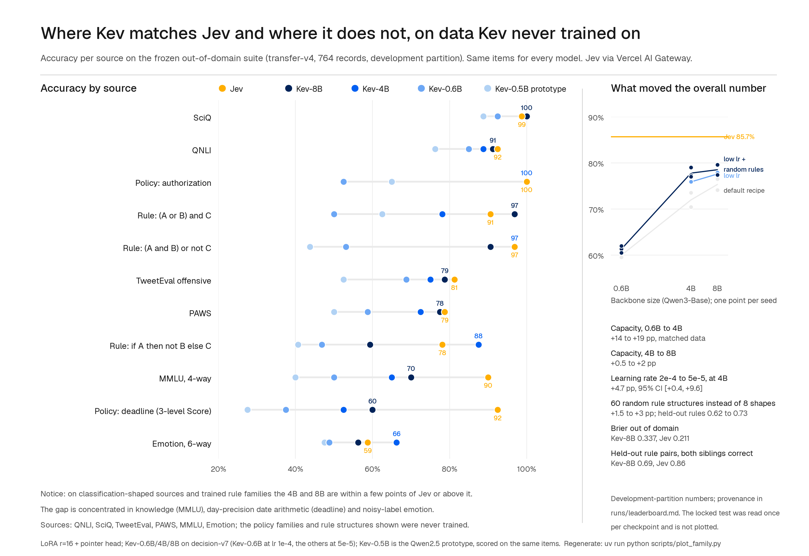
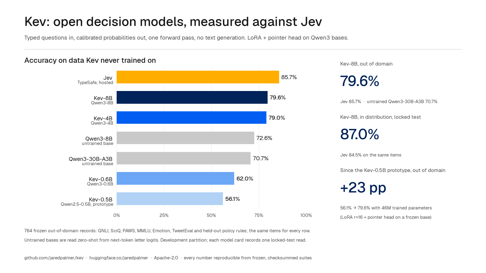
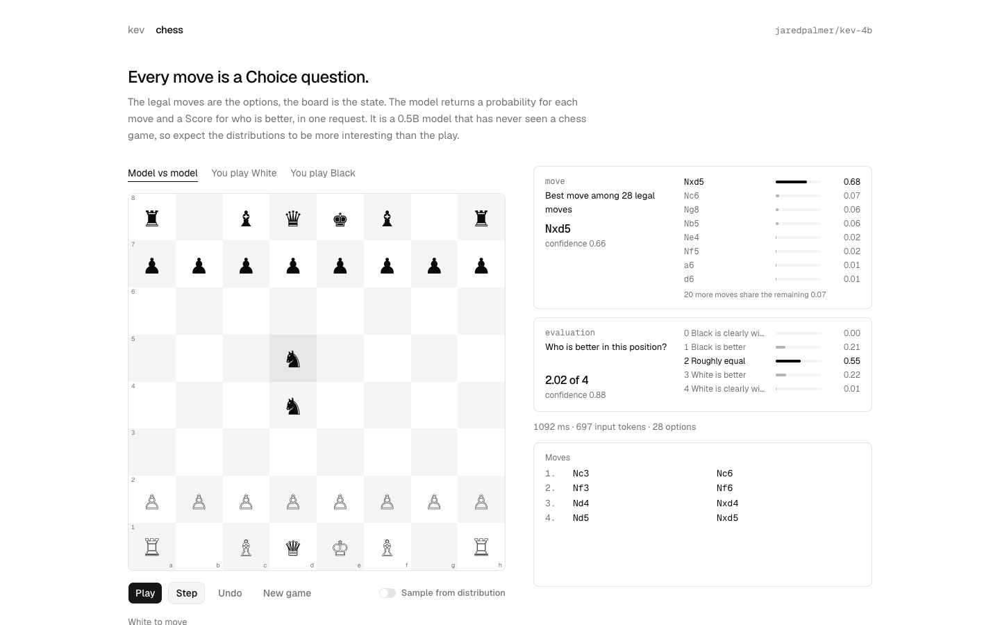
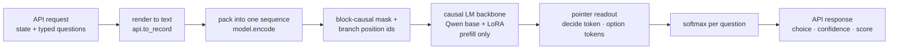
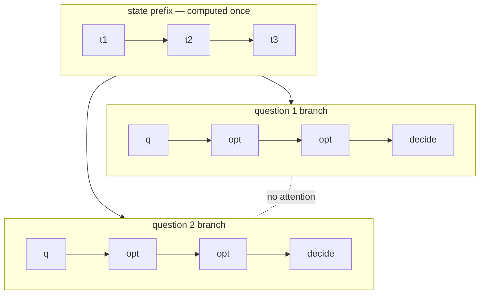

# Kev

Decision model in the style of TypeSafe's Jev. Typed questions in, probabilities out, one forward pass.

<p>
  <a href="https://github.com/jaredpalmer/kev/actions/workflows/ci.yml"></a>
  <a href="https://huggingface.co/collections/jaredpalmer/kev-6aad9d0ea49f2589665e07cd"></a>
  <a href="https://huggingface.co/datasets/jaredpalmer/kev-suites"></a>
  <a href="PLAN.md"></a>
  <a href="LICENSE"></a>
</p>


Kev is a LoRA adapter and a small readout head on a Qwen3 base model (0.6B, 4B or 8B). It reads a document once and answers several typed questions about it in one prefill pass. There is no decoding. The document and the questions are packed into one sequence. A block-causal mask lets each question attend to the document but not to the other questions. A pointer head scores each question's options against that question's decision token and applies a softmax. The head is trained with cross-entropy on labelled outcomes, so the output probabilities are learned directly, not generated as text.

The architecture follows the reconstruction of Jev in [Jev's Architecture Unmasked](https://archerhume.com/posts/jevs-architecture-unmasked). The API follows TypeSafe's [System One](https://docs.typesafe.ai/api) contract, so the official `typesafe-sdk` works against a local Kev server after changing `base_url`.

## Highlights

- Three question types: `noul` (yes/no), `choice` (2–255 options) and `score` (ordered levels). All three use the same readout.
- One forward pass answers every question in the request. The state is encoded once.
- Questions cannot see each other. Packed and separate requests agree to within 4e-6.
- The output is a probability distribution trained with cross-entropy on labelled outcomes. Out of domain, Kev-4B has Brier 0.33 and 8% confident errors on sources it did not train on.
- `POST /v1/systemone` accepts and returns TypeSafe's request and response shapes. The SDK quickstart runs unmodified.
- Three checkpoints (0.6B, 4B, 8B) are scored on frozen, checksummed suites with a locked test partition, and compared with Jev on the same items. Out of domain: Kev-4B 0.79, Kev-8B 0.80, Jev 0.86.
- Kev-0.6B trains in minutes on one H100 or in about 2 h on an Apple M5. Kev-4B and Kev-8B train in 40–70 min on one H100 via Modal and serve on a 32 GB Mac in bf16.



## Installation

Requires Python 3.12+, [uv](https://docs.astral.sh/uv/), and Node 20+ for the playground. Serving is tested on Apple Silicon (MPS). Training and evaluation are tested on CUDA (H100 via Modal) and MPS.

```bash
git clone https://github.com/jaredpalmer/kev.git && cd kev
uv sync --extra serve
cd playground && npm install && cd ..
```

### Weights

All checkpoints are in the [Kev collection](https://huggingface.co/collections/jaredpalmer/kev-6aad9d0ea49f2589665e07cd) on the Hugging Face Hub. `--run` accepts a Hub id; the base model downloads on first load. Start with Kev-4B. It has the best accuracy for its size and serves on a 32 GB Mac in bf16.

| checkpoint | base | in-distribution (dev / locked test) | out-of-domain (dev / locked test) | serve on a Mac | card |
|---|---|---|---|---|---|
| [Kev-8B](https://huggingface.co/jaredpalmer/kev-8b) | Qwen3-8B-Base | 0.863 / **0.870** | **0.796** / 0.780 | bf16, ~0.5 s | [card](docs/model-cards/kev-8b.md) |
| [Kev-4B](https://huggingface.co/jaredpalmer/kev-4b) | Qwen3-4B-Base | 0.854 / 0.856 | 0.790 / **0.806** | bf16, ~0.3 s | [card](docs/model-cards/kev-4b.md) |
| [Kev-0.6B](https://huggingface.co/jaredpalmer/kev-0.6b) | Qwen3-0.6B-Base | 0.801 / 0.808 | 0.620 / 0.642 | fp32, ~0.1 s | [card](docs/model-cards/kev-0.6b.md) |
| [Kev-0.5B](https://huggingface.co/jaredpalmer/kev-0.5b) · prototype | Qwen2.5-0.5B | 0.712 / – | 0.561 / – | fp32, ~0.2 s | [card](docs/model-cards/kev-0.5b.md) |
| Jev (hosted reference) | – | 0.845 / – | 0.857 / – | | |

Every row uses the same frozen items (`evals/v4`): 1,200 in-distribution questions from the trained sources, and 764 out-of-domain records from six public sources Kev did not train on plus held-out programmatic policy rules. The development partitions were used to select checkpoints. The locked test was read once per checkpoint; the result is recorded in each card. Latency is for five 3-way questions on a ~230-token state on an M5. Kev-0.5B is the original laptop-trained prototype (September 2026). It is kept on the Hub for reference and was not scored on the locked test. The three released checkpoints are also attached to the [GitHub release](https://github.com/jaredpalmer/kev/releases/tag/kev-family) as tarballs with SHA-256 sums.



## Quick Start

Start the server:

```bash
KEV_DTYPE=bf16 uv run --extra serve python -m kev.serve --run jaredpalmer/kev-4b --port 8009
```

Send a request:

```bash
curl -s localhost:8009/v1/systemone -H 'content-type: application/json' -d '{
  "state": "Shoes arrived two weeks late and in the wrong size. Also I see two charges on my card.",
  "model": "kev-latest",
  "questions": {
    "department":  {"type": "choice", "instructions": "Which team should handle this?",
                    "criteria": {"returns": "Exchanges, refunds, wrong or damaged items",
                                 "shipping": "Delivery status, delays, lost packages",
                                 "billing": "Charges, invoices, payment problems"}},
    "escalate":    {"type": "noul",  "instructions": "Does this need urgent human attention?"},
    "frustration": {"type": "score", "instructions": "How frustrated is the customer?",
                    "criteria": ["Calm", "Frustrated", "Very angry"]}
  }}'
```

```json
{
  "model": "kev-latest",
  "answers": {
    "department":  { "type": "choice", "choice": "returns", "confidence": 0.83,
                     "probabilities": { "returns": 0.89, "shipping": 0.04, "billing": 0.07 } },
    "escalate":    { "type": "noul", "noul": 0.54 },
    "frustration": { "type": "score", "score": 1.25, "confidence": 0.88,
                     "legend": { "0": "Calm", "1": "Frustrated", "2": "Very angry" },
                     "probabilities": { "0": 0.00, "1": 0.75, "2": 0.25 } }
  },
  "usage": { "input_tokens": 101, "output_tokens": 161 },
  "latency_ms": 277
}
```

(Kev-4B, bf16, M5.)

With the TypeSafe SDK:

```python
from typesafe_sdk import TypeSafeClient, Choice, Noul, Score

client = TypeSafeClient(api_key="local", base_url="http://127.0.0.1:8009", model="kev-latest")
r = client.system_one(
    state="I was charged twice. Please fix this ASAP.",
    questions={
        "billing": Noul(instructions="Is this ticket about billing?"),
        "tone": Choice(instructions="What is the customer's tone?", criteria={"calm": None, "frustrated": None, "angry": None}),
        "urgency": Score(instructions="How urgent is this ticket?", criteria=["can wait", "this week", "today"]),
    },
)
r.nouls["billing"].noul, r.choices["tone"].choice, r.scores["urgency"].score
```

### Playground

```bash
cd playground && npm run dev -- -p 3001
```

Open [localhost:3001](http://localhost:3001). Load a preset, edit the state and questions, press `⌘↵`. "Packed vs separate" compares one N-question request with N single-question requests. "Permute" asks a Choice question again under six option orders. The "Isolation probe" and "Boundary forgery" presets reproduce the two experiments from the blog post.

Chess is at [localhost:3001/chess](http://localhost:3001/chess). The legal moves are the options of one Choice question, the board is the state, and a Score question rates the position in the same request. You can play against the model or let it play itself. Games are stored in `localStorage`.



### Serving Performance

`kev.serve` merges the LoRA into the base weights in fp32 before casting to the serving dtype. In bf16 this is closer to the fp32 numbers than running the adapter unmerged. It uses SDPA attention on Apple GPUs, pads sequences to 64-token buckets on MPS (kernels warm up once per shape), and keeps a small LRU of state-prefix KV caches, so a repeated state only pays for its question branches. The cache is exact: under the block-causal mask the state activations do not depend on the questions. Kev-4B, bf16, M5, five 3-way questions, median model time:

| | before | now |
|---|---|---|
| short state (232 tokens), new text every call | 442 ms | **296 ms** |
| long state (772 tokens), new text every call | 1290 ms | **861 ms** |
| long state, repeated (agent loops, permute/separate probes) | 1214 ms | **242 ms** |

Each change is parity-tested against the fp32 path (`tests/test_v3.py`). On 24 out-of-domain records the served bf16 probabilities are within 0.017 of fp32 with no argmax flips. `KEV_MERGE=0`, `KEV_ATTN=eager`, `KEV_SHAPE_BUCKET=1` and `KEV_PREFIX_CACHE=0` restore the old behaviour. On an H100 the same request takes about 40 ms.

## API

### `POST /v1/systemone`

```jsonc
{
  "state": "…",                          // string | object | array — the content to evaluate
  "model": "kev-latest",
  "questions": {
    "<id>": {                            // you choose the id; the model never sees it
      "type": "noul" | "choice" | "score",
      "instructions": "…",               // string | object | array
      "criteria": …                      // noul: {true?, false?}  choice: {option: description|null}  score: [level, …]
    }
  }
}
```

| Answer type | Fields | Derived from the distribution `p` |
|---|---|---|
| `noul` | `noul` | `p[yes]` |
| `choice` | `choice`, `probabilities`, `confidence` | `argmax`, `p` by option key, `(p_max − 1/K) / (1 − 1/K)` |
| `score` | `score`, `legend`, `probabilities`, `confidence` | `Σ k·p[k]`, level index → text, `p` by level index |

Structured `instructions`, `criteria` and `state` are flattened to labelled text. User text cannot forge option or branch delimiters. Validation errors return `422`.

### Other Endpoints

| Method | Path | Purpose |
|---|---|---|
| `GET` | `/v1/models` | Model, base and run info |
| `POST` | `/v1/systemone/permute` | One Choice question under N option orders |
| `POST` | `/v1/systemone/separate` | Each question in its own pass, for comparison |

There is no authentication. The server is meant for local use.

## How It Works



**Packing.** The state and every question go into one token sequence. Reserved tokens mark the structure.

```
<state> …state…
<q> instructions <opt> option 1 </opt> <opt> option 2 </opt> … <decide>    ← question 1
<q> instructions <opt> option 1 </opt> <opt> option 2 </opt> … <decide>    ← question 2
```

**Mask.** Position `i` attends to `j` when `j ≤ i` and `j` is in the state or in the same question as `i`. State tokens are computed once. Question branches never see each other.



**Positions.** Each branch restarts its position ids after the state, so every question sees the same layout: the state, then one question. Question order does not affect the result.

**Readout.** A pointer head scores the `</opt>` hidden state of each option against the `<decide>` hidden state and applies a softmax. `K` is the number of options in the request. `<decide>` comes after all options, so the model has read the whole list before scoring. This is what makes none-of-the-above options work.

**Training.** LoRA (r=16) on the backbone, head trained from scratch, cross-entropy on the option distribution. Training data and live requests go through the same renderer, so the model sees the same format at training time and at inference.

## Training

Training data are public datasets converted to TypeSafe-shaped requests, plus programmatic policy data, frozen into checksummed suites under `evals/`. Kev-4B and Kev-8B train on `decision-v7`: ten public sources at 1,000 records each, nine policy template families as minimal pairs (896 records), and 1,680 records from 60 randomly generated rule structures rendered in four styles. Two epochs, LoRA r=16, lr 5e-5. The learning rate was the largest single improvement in the recipe: the default 2e-4 erodes what the base model already knows (details and the base-model probe are in [PLAN.md](PLAN.md)). Kev-0.6B trains on the same suite at lr 1e-4.

```bash
# sanity run, ~1 minute
uv run python -m kev.train --n_per_source 40 --accum 4 --out runs/smoke

# Kev-0.6B on a Mac (~2 h on an M5) or a few minutes on one H100
uv run python -m kev.train --suite evals/v7/decision-v7 --base Qwen/Qwen3-0.6B-Base --epochs 2 --lr 1e-4 --p_none_pair 0.25 --out runs/kev-0.6b

# the Kev-4B recipe (one H100 via Modal, ~50 min; see below)
uv run python -m kev.train --suite evals/v7/decision-v7 --base Qwen/Qwen3-4B-Base --epochs 2 --lr 5e-5 \
    --batch 4 --accum 2 --dtype bf16 --checkpointing 1 --p_none_pair 0.25 --device cuda --out runs/kev-4b
```

| Flag | Default | Purpose |
|---|---|---|
| `--base` | `Qwen/Qwen3-0.6B-Base` | Causal LM backbone. Any Qwen2.5 or Qwen3 base model works; the released checkpoints use Qwen3-0.6B/4B/8B-Base |
| `--n_per_source` | `1000` | Records sampled per dataset |
| `--holdout` | – | Sources to exclude, e.g. `mnli,sst5`, for out-of-source evaluation |
| `--perm_kl` | `0` | Optional symmetric KL between predictions under two option orders |
| `--ord_w` | `0` | Optional ranked probability score for ordered levels |
| `--suite` | – | Train on a frozen suite's training partition |
| `--batch`, `--dtype` | `1`, `fp32` | Padded batch size; `bf16` autocast on CUDA (fp32 master weights) |
| `--device` | auto | `cuda`, `mps`, or `cpu` |
| `--p_none_pair` | `0` | Fraction of Choice records that also emit a none-of-the-above minimal pair (true option present / removed) |
| `--option_isolation` | `0` | Option spans as isolated sub-branches with shared positions. Exact permutation invariance, but costs accuracy at 4B |
| `--lora_targets`, `--head_lr`, `--weight_decay` | `all`, `=lr`, `0.01` | Low-drift knobs. None beat plain lr 5e-5 |

The released checkpoints use cross-entropy only. `--perm_kl` and `--ord_w` are research knobs, and neither beat the plain recipe. The ordinal loss is a ranked probability score over cumulative probabilities, which is a proper scoring rule.

On a Mac, run one training job at a time. Two jobs on the same Apple GPU slow each other by about 10×. The Mac path is kept working, but anything longer than a smoke run should go to Modal.

### Modal

Each trial in a study runs in its own H100 container. Trials run in parallel. Results are pulled back into `runs/` and ranked by the same code that runs locally.

```bash
uv run modal token new                                    # once; opens the browser
KEV_GPU=T4 uv run modal run modal_app.py::smoke           # end-to-end check, ~1 minute of GPU

uv run modal deploy modal_app.py                          # once; studies run on the deployed app and survive disconnects
uv run modal run modal_app.py::study \
    --suite evals/v7/decision-v7 --plan experiments/v7-final.json \
    --name my-study --transfer evals/v4/transfer-v4 --budget 30 --timeout 7200
uv run modal run modal_app.py::pull --name my-study       # results -> runs/my-study, ranked
uv run modal run modal_app.py::locked_test --trial my-study/00-trial-0 --name my-candidate   # one read, ever
```

A plan is a JSON list of 1–8 trials over an allowlisted set of training parameters (`kev/experiment.py`). Each trial records the local git commit, the suite hash and the hashes of the shipped `kev/*.py`. The container refuses to run if they differ from what the launcher hashed. Training uses TF32 and optional bf16. Evaluation is fp32-exact, because TF32 alone moves probabilities by about 1e-3, which is enough to fail the isolation gate. Measured throughput: 0.019 s/record for Qwen2.5-0.5B at batch 8 on an H100 and 0.34 s/record on an M5, or about $0.15–0.30 per 0.5B trial.

## Evaluation

Every number in this README comes from `kev.benchmark` on frozen, checksummed suites under `evals/`. Each suite has training, calibration, development and locked test partitions, pinned dataset and base-model revisions, and per-record provenance. Development partitions select models. The locked test is read once per published candidate (`--allow-test`, or `modal_app.py::locked_test`, which refuses a second read). Manifests and dev/test partitions are in git. Training partitions over 10 MB are fetched from the [`jaredpalmer/kev-suites`](https://huggingface.co/datasets/jaredpalmer/kev-suites) mirror and verified against the manifest hash on first use.

| suite | trains on | evaluates | used for |
|---|---|---|---|
| `decision-v4` / `v6` | 10–13 public sources + programmatic policy pairs | 1,200 in-distribution questions | model selection, Kev-4B / Kev-8B |
| `transfer-v4` | nothing | QNLI, SciQ, TweetEval, PAWS, MMLU, Emotion + held-out policy rule structures | out-of-domain, every trial |
| `decision-v1`, `transfer-v1` | six sources | first prototype (Kev-0.5B) vs Jev comparison | historical |

```bash
uv run python -m kev.benchmark --run jaredpalmer/kev-4b --suite evals/v4/transfer-v4 --out runs/my-eval      # out of domain
uv run python -m kev.benchmark --run jaredpalmer/kev-4b --suite evals/v4/decision-v4 --out runs/my-eval-id   # in distribution
uv run python -m kev.benchmark --remote http://127.0.0.1:8009 --suite evals/v4/transfer-v4 --out runs/my-remote   # any System One endpoint
uv run python -m kev.experiment --suite evals/v4/decision-v4 --plan experiments/auto/lowdrift-4b-v4.json --out runs/my-study --transfer evals/v4/transfer-v4
uv run python -m kev.autoresearch leaderboard        # rebuild runs/leaderboard.md from every study
```

`kev.benchmark` reports accuracy, Brier, ECE, confident-error rate, held-out-pair correctness, permutation flips, packed-vs-separate isolation and per-source breakdowns. `kev.compare` runs record-clustered paired bootstraps between two result directories.

`kev.experiment` runs configuration-only trials. It refuses configs outside a bounded allowlist, records code, suite and git hashes, checks coverage, isolation and packing, scores the transfer suite, and never reads the locked test. `kev.autoresearch` runs bounded hill-climb rounds over the same allowlist on Modal and maintains the leaderboard. There are 90 trials so far, all in [`runs/leaderboard.md`](runs/leaderboard.md).

### Comparison with Jev

`kev.jev` scores the same frozen partitions against `typesafe-ai/jev` through Vercel AI Gateway (AI SDK 7 `experimental_evaluate`, cost-capped, about two cents per suite). Jev is a hosted product and its training exposure to these public datasets is unknown, so this is a comparison on shared items, not a controlled ablation.

| out-of-domain, `transfer-v4` dev (764 records) | Qwen3-8B base, untrained | Qwen3-30B-A3B base, untrained | Kev-0.5B (prototype) | Kev-0.6B | Kev-4B | Kev-8B | Jev |
|---|---|---|---|---|---|---|---|
| accuracy | 0.726 | 0.707 | 0.561 | 0.620 | 0.790 | 0.796 | **0.857** |
| Brier (lower is better) | 0.366 | 0.365 | 0.534 | 0.536 | 0.328 | 0.337 | **0.211** |
| confident errors (p ≥ 0.9 and wrong) | 0.6% | 0.5% | 2.0% | 10.8% | 8.2% | 9.9% | 3.7% |
| held-out policy rules, both siblings correct | 0.55 | 0.44 | 0.09 | 0.08 | 0.73 | 0.69 | **0.86** |
| MMLU / PAWS | 0.75 / 0.84 | 0.79 / 0.82 | 0.40 / 0.50 | 0.50 / 0.59 | 0.65 / 0.72 | 0.70 / 0.78 | 0.90 / 0.79 |

The two untrained columns are the base models read zero-shot from next-token letter logits (`scripts/base_mmlu_probe.py`). Kev-8B beats its own base by +5.8 pp [+1.8, +10.0] and the untrained 30B-A3B by +9.7 pp [+4.7, +14.4]. Both untrained models beat every Kev on MMLU and PAWS, so the fine-tune still loses some base-model capability.

Findings from the controlled studies (record-clustered paired bootstraps, seeds replicated; full log in [PLAN.md](PLAN.md)):

- Model size is the main factor out of domain. With public examples and synthetic budget held equal, 0.6B → 4B is +14–19 pp and 4B → 8B is +1.5–2 pp.
- Fine-tuning erodes base capability, and the learning rate controls how much. The 4B base scores 0.69 zero-shot on the MMLU items; the default recipe trained it down to 0.60–0.66. lr 5e-5 recovers most of this: +4.7 pp [+0.4, +9.6], replicated at three seeds on 4B and 8B.
- More public data raises in-distribution accuracy and lowers or does not change transfer. Knowledge MCQ sources lift MMLU by a few points without moving the total.
- Programmatic contrastive policy pairs teach the trained rule structures (0.85–1.0) and transfer partially to unseen ones (0.5–0.67 at 4B/8B, near chance at 0.6B). None-of-the-above minimal pairs fixed the "none" shortcut in-domain (0.75 → 0.93 at 4B).
- Structural diversity in the synthetic rules (60 random rule trees with negation anywhere, instead of eight fixed shapes) fixed the two failing held-out compositions (0.62–0.66 → 0.75–0.97) and produced the released 4B/8B checkpoints (+3 pp transfer). Day-precision date arithmetic (`deadline`) did not improve under any data we generated (0.45–0.60; untrained bases 0.53; Jev 0.93).
- Fourteen one-knob mutations around the low-lr recipe, anchoring to the base model's own distribution, and weight-space interpolation all land within ±1 pp. The remaining gap to Jev is in MMLU, PAWS, Emotion and date arithmetic, not in hyperparameters.

The prototype's first comparison (Kev-0.5B on `decision-v1`/`transfer-v1`: −1.8 pp in-distribution with a CI that includes zero, **−19.1 pp [−23.1, −15.0]** out of domain) is kept in `runs/kev-vs-jev-v1.json` and `runs/kev-vs-jev-transfer-v1.json`. `uv run python scripts/plot_family.py` draws the per-source figure above and `uv run python scripts/plot_tweet.py` draws the benchmark card. Both read saved result files only and share `scripts/chartstyle.py`.

The mechanism tests below are from `kev.evaluate` on the prototype. Every released checkpoint reproduces the isolation and packing results (max delta 4e-6, checked on every trial).

| Mechanism test | Result |
|---|---|
| Isolation — secret in sibling question / absent / in state | `p = 0.03` / `0.03` / **`0.99`** |
| Packed vs separate — max probability difference | **`3.7e-6`**, packed 2.0× faster |
| Permutation — argmax flips under 4 option orders | 7.4% |
| IIA — log-odds shift from one irrelevant option | 0.13 mean, 0.34 p90 |
| Boundary forgery — fake delimiters in option text | option count unchanged, forged option `p ≤ 0.09` |

## Limitations

- Out of domain, Kev trails Jev by 6–7 points at 4B/8B and by 24 points at 0.6B. The gap is in knowledge (MMLU 0.69–0.75 vs 0.90), paraphrase (PAWS), noisy-label emotion, and date arithmetic. Fine-tuning still loses some base-model capability even at lr 5e-5.
- Held-out rule reasoning (unseen compositions of policy conditions) scores 0.62–0.73 both-siblings-correct depending on the seed. Jev scores 0.86. Most remaining failures are day-precision date arithmetic, which no data we generated has improved.
- Calibration is in-distribution only. A temperature fitted in-domain does not transfer. Out-of-domain probabilities are usable but not calibrated (ECE about 0.1).
- Product-shaped questions with no training analogue are not guaranteed to work. The low-drift 4B/8B recipes carry fewer task priors than the 0.6B and can answer differently on the same input. Measure on your own data.
- Context is limited. Training used 384 state tokens and 1,024 branch tokens; serving caps at 8,192. Jev allows about 32k per branch.
- Serving handles one request at a time. The state prefix is cached across requests (`KEV_PREFIX_CACHE`, states of 384 tokens or more) but there is no cross-request batching. 8B needs bf16 (`KEV_DTYPE=bf16`) on a 32 GB Mac.
- Score confidence uses a stand-in formula. TypeSafe has not published theirs.

## Development

```bash
uv run python -m pytest tests/test_unit.py -q                                      # no weights, no server; runs in CI
KEV_BASE_URL=http://127.0.0.1:8009 uv run --extra serve python -m pytest tests/test_api.py -q   # against a running server
cd playground && npm run lint && npx tsc --noEmit -p .
```

`tests/test_api.py` runs the TypeSafe docs' example requests and the official SDK against the local server.

<details>
<summary>Troubleshooting</summary>

- `MPS backend out of memory` while training: do not enable `output_hidden_states`; read `last_hidden_state` from the bare backbone. Do not add tokens with peft `trainable_token_indices`. Lower `--n_per_source` on small machines.
- The playground shows `connecting…` and buttons do nothing: Next.js 16 dev only trusts the hostname it started with. Use `localhost:3001` or add your host to `allowedDevOrigins` in `next.config.ts`. Nothing is logged, so verify hydration with a browser, not `curl`.
- `Dataset scripts are no longer supported`: use `legacy-datasets/banking77`. This is already wired in `data.py`.

</details>

## Authors

- Jared Palmer ([@jaredpalmer](https://github.com/jaredpalmer))

Built with [Devin](https://devin.ai). Architecture claims from [Archer Hume](https://archerhume.com/posts/jevs-architecture-unmasked). API contract from [TypeSafe](https://docs.typesafe.ai/api). Backbones: [Qwen3](https://huggingface.co/Qwen/Qwen3-4B-Base) base models (0.6B, 4B, 8B); the prototype used [Qwen2.5-0.5B](https://huggingface.co/Qwen/Qwen2.5-0.5B). Related work: [Hydragen](https://arxiv.org/abs/2402.05099), [DeFT](https://arxiv.org/abs/2404.00242), [FIRST](https://arxiv.org/abs/2406.15657).

## License

[Apache-2.0](LICENSE). The base models are distributed under the Qwen license. Datasets carry their own licenses; see the [model cards](docs/model-cards/).
